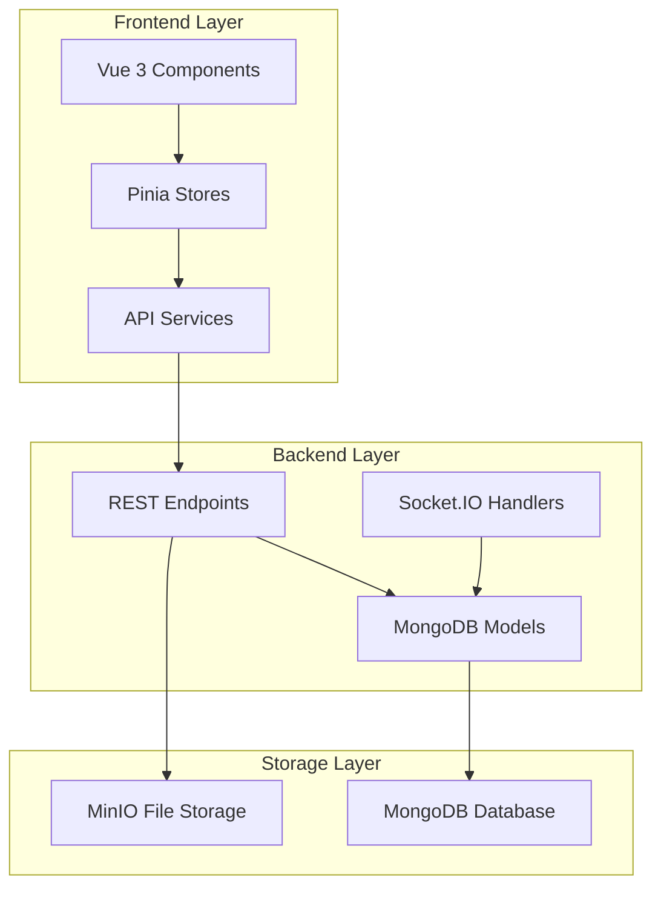
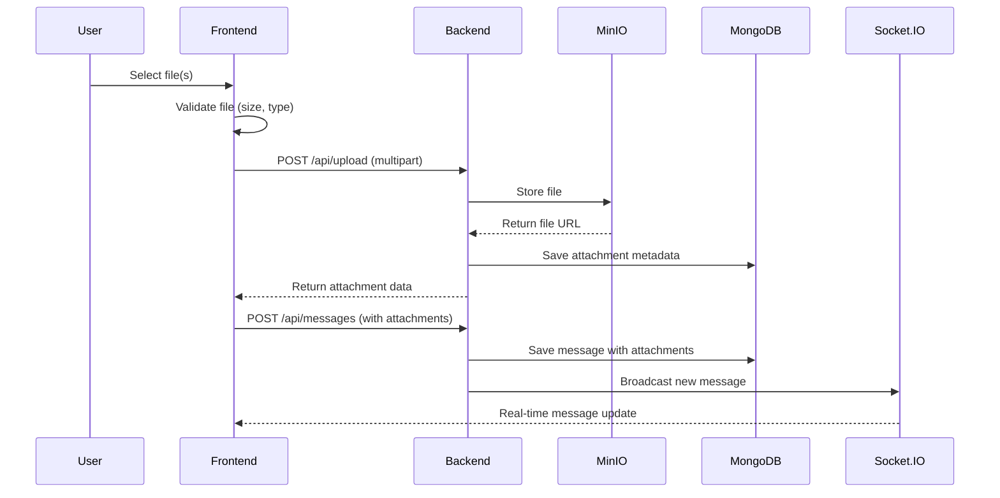
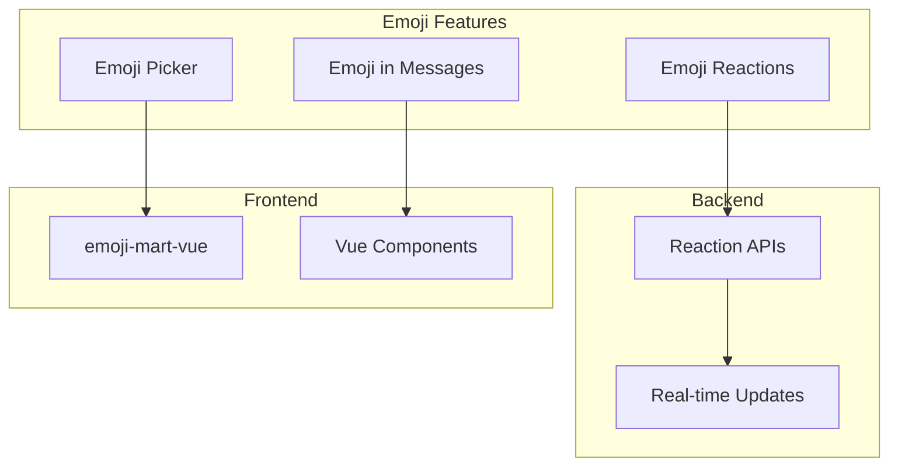
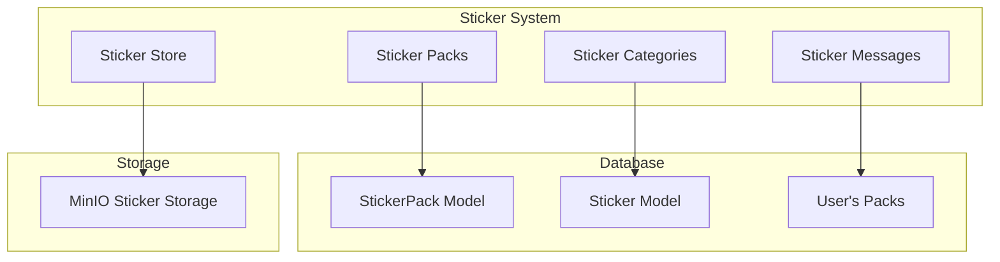
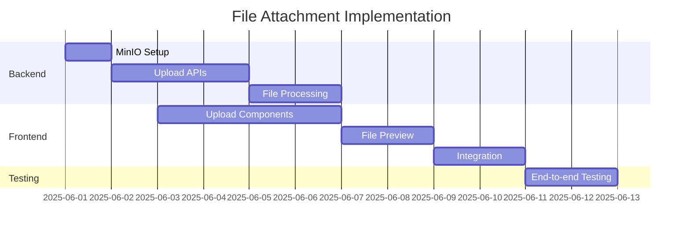
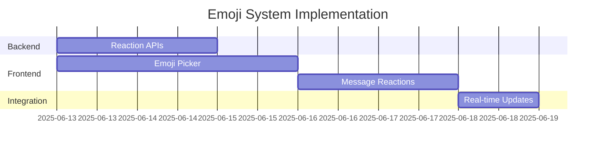
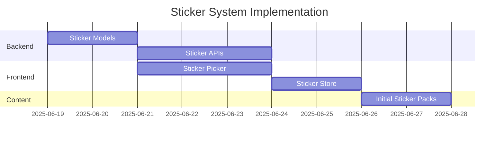

# 🚀 ZaloClone Feature Implementation Plan
**File Attachments, Emoji System & Sticker System**

## 📊 Project Analysis & Current Foundation

### Current Strengths
- ✅ **Real-time messaging** with Socket.IO working perfectly
- ✅ **Message model** already supports `attachments` and `reactions` arrays
- ✅ **MessageType enum** includes `IMAGE`, `FILE`, `AUDIO`, `VIDEO` 
- ✅ **Stable state management** with currentChat persistence
- ✅ **RESTful API structure** easy to extend
- ✅ **Existing `reactToMessage` endpoint** ready for emoji reactions

### Architecture Overview


## 🎯 Implementation Strategy & Timeline

### Phase 1: File Attachment System (Week 1-2)
**Priority: High** - Foundation for other features

### Phase 2: Emoji System (Week 3)  
**Priority: Medium** - Quick wins, enhances UX

### Phase 3: Sticker System (Week 4-5)
**Priority: Medium** - Advanced feature, builds on file system

---

## 📁 Phase 1: File Attachment System (14-16 days)

### 🏗️ Technical Architecture



### 🗄️ Database Schema Extensions

#### New Models Required:
- **FileUpload Model**: Store file metadata, URLs, uploader info
- **Enhanced Attachment Interface**: Add fileId, thumbnail, duration fields

#### Database Indexes:
- `fileuploads.uploadedBy + createdAt`
- `fileuploads.chatId + mimetype`
- `messages.attachments.fileId`

### 🔧 Backend Implementation Tasks

#### Infrastructure Setup (3 days):
- **MinIO Configuration**: Bucket setup (chat-files, thumbnails, temp-uploads)
- **File Processing Utils**: Image thumbnails with Sharp, video thumbnails with FFmpeg
- **Multer Configuration**: File upload middleware with validation

#### API Development (3 days):
- **Upload Endpoints**: Single/multiple file upload with progress
- **File Serving**: Download and thumbnail serving endpoints
- **File Management**: Delete and cleanup endpoints

### 🎨 Frontend Implementation Tasks

#### Core Components (4 days):
- **FileUpload Component**: Drag & drop, file validation, preview
- **FilePreview Component**: Different previews for images/videos/documents
- **Upload Progress**: Real-time upload status and progress bars

#### Integration (3 days):
- **Chat Integration**: File upload button in message input
- **Message Display**: Show attachments in message bubbles
- **Pinia Store**: File upload state management

### 📦 Required Dependencies

#### Backend:
- `multer`: File upload handling
- `minio`: Object storage client
- `sharp`: Image processing and thumbnails
- `ffmpeg-static`: Video thumbnail generation

#### Frontend:
- `compressorjs`: Client-side image compression
- `@vueuse/core`: Vue utilities for file handling

### 🔒 Security & Validation Features
- File type whitelist (images, videos, audio, documents)
- File size limits (10MB images, 100MB videos, 50MB audio, 25MB documents)
- Malware scanning integration points
- Secure file serving with access controls

---

## 😀 Phase 2: Emoji System (7-8 days)

### 🏗️ Technical Architecture



### 🔧 Backend Extensions (2 days)

#### API Enhancements:
- **Extend existing `reactToMessage` endpoint** for emoji support
- **Reaction aggregation** endpoint for message reaction summaries
- **Socket.IO broadcasting** for real-time reaction updates

#### Database Updates:
- **Enhanced Reaction Schema**: Add reaction type field (emoji/sticker)
- **Reaction indexing** for better query performance

### 🎨 Frontend Implementation (5 days)

#### Core Components:
- **EmojiPicker Component**: Using emoji-mart-vue library
- **MessageReactions Component**: Display reaction bubbles with counts
- **Emoji Integration**: Add emoji picker to message input and reaction UI

#### Features:
- **Quick Reactions**: Common emojis (👍, ❤️, 😂, 😮, 😢, 😡)
- **Emoji Categories**: People, Nature, Food, Activities, Travel, Objects, Symbols
- **Search Functionality**: Find emojis by keywords
- **Recent Emojis**: Track user's frequently used emojis

### 📦 Required Dependencies

#### Frontend:
- `emoji-mart-vue`: Comprehensive emoji picker component
- Emoji data and search functionality included

### ⚡ Performance Optimizations
- **Lazy loading** emoji picker to reduce initial bundle size
- **Emoji caching** for better performance
- **Virtual scrolling** for large emoji lists

---

## 🎪 Phase 3: Sticker System (10-12 days)

### 🏗️ Technical Architecture



### 🗄️ Database Schema (2 days)

#### New Models:
- **StickerPack Model**: Pack metadata, categories, pricing
- **Sticker Model**: Individual sticker data, keywords, order
- **UserStickerPack Model**: User's purchased/downloaded packs

#### Key Features:
- **Pack categorization** (Funny, Cute, Animals, Memes, etc.)
- **Search capabilities** with keyword indexing
- **Premium pack support** with pricing
- **Download/purchase tracking**

### 🔧 Backend Implementation (3 days)

#### API Endpoints:
- **Sticker Pack Management**: CRUD operations for packs
- **User Pack Management**: Purchase/download/activate packs
- **Sticker Search**: Search across all available stickers
- **Sticker Serving**: Optimized sticker delivery

#### Features:
- **Pack validation** and content management
- **Usage analytics** for popular stickers
- **CDN integration** for faster sticker loading

### 🎨 Frontend Implementation (5 days)

#### Core Components:
- **StickerPicker Component**: Pack tabs with sticker grids
- **StickerStore Component**: Browse and download sticker packs
- **Pack Management**: Enable/disable user's sticker packs

#### Features:
- **Sticker categories** with intuitive navigation
- **Pack preview** before download/purchase
- **Recent stickers** quick access
- **Animated sticker support** (GIF/WebP)

#### Enhanced Message Types:
- **Sticker-only messages** with larger display
- **Sticker + text combinations**
- **Sticker reactions** (alternative to emoji reactions)

### 📦 Required Dependencies

#### Backend:
- **Image optimization** libraries for sticker processing
- **CDN integration** for global sticker delivery

#### Frontend:
- **Lazy loading** for sticker packs
- **Caching strategies** for downloaded stickers

---

## 📈 Implementation Timeline & Effort Estimation

### Phase 1: File Attachment System (14-16 days)



**Backend Tasks (6-7 days):**
- MinIO configuration and bucket setup
- File upload APIs with validation  
- Image/video processing and thumbnails
- Error handling and cleanup

**Frontend Tasks (6-7 days):**
- File upload component with drag & drop
- File preview and validation UI
- Chat integration and progress indicators

### Phase 2: Emoji System (7-8 days)



**Backend Tasks (2 days):**
- Reaction CRUD APIs
- Socket.IO reaction broadcasting

**Frontend Tasks (5 days):**
- emoji-mart-vue integration
- Emoji picker component
- Message reaction UI

### Phase 3: Sticker System (10-12 days)



**Backend Tasks (5 days):**
- Database models and relationships
- Sticker management APIs

**Frontend Tasks (5 days):**
- Sticker picker component
- Sticker store interface

**Content Creation (2 days):**
- Create initial sticker packs
- Test data and categories

### 📊 Total Effort Estimation

| Feature | Backend Days | Frontend Days | Testing Days | Total Days |
|---------|-------------|---------------|--------------|------------|
| File Attachments | 6-7 | 6-7 | 2 | **14-16** |
| Emoji System | 2 | 5 | 1 | **7-8** |  
| Sticker System | 5 | 5 | 2 | **10-12** |
| **TOTAL** | **13-14** | **16-17** | **5** | **31-36** |

**Overall Timeline: 5-6 weeks** (with parallel development possible)

---

## 🚀 Technology Stack & Dependencies

### 📦 New Dependencies

#### Backend
```json
{
  "dependencies": {
    "multer": "^1.4.5",
    "minio": "^8.0.0",
    "sharp": "^0.33.0",
    "ffmpeg-static": "^5.2.0",
    "node-cache": "^5.1.2"
  }
}
```

#### Frontend
```json
{
  "dependencies": {
    "emoji-mart-vue": "^3.0.0",
    "@vueuse/core": "^10.0.0",
    "compressorjs": "^1.2.1"
  }
}
```

### 🔧 Environment Configuration

```bash
# MinIO Configuration
MINIO_ENDPOINT=localhost
MINIO_PORT=9000
MINIO_USE_SSL=false
MINIO_ACCESS_KEY=minioadmin
MINIO_SECRET_KEY=minioadmin

# File Upload Limits
MAX_FILE_SIZE=50MB
MAX_FILES_PER_MESSAGE=10
ALLOWED_IMAGE_TYPES=jpeg,png,webp,gif
ALLOWED_DOCUMENT_TYPES=pdf,doc,docx,txt
ALLOWED_AUDIO_TYPES=mp3,wav,ogg
ALLOWED_VIDEO_TYPES=mp4,webm,mov

# Sticker Configuration
STICKER_PACK_SIZE_LIMIT=20
DEFAULT_STICKER_PACKS=pack1,pack2,pack3
```

---

## 🔄 Integration with Existing System

### Leveraging Current Infrastructure
- **Existing Message Model**: Already has `attachments` and `reactions` arrays
- **Socket.IO System**: Extend for real-time file upload progress and reactions
- **API Pattern**: Follow existing RESTful structure
- **Authentication**: Use current JWT middleware
- **State Management**: Extend current Pinia stores

### Database Optimization Strategy
- **Existing Indexes**: Build upon current message indexing
- **New Indexes**: Strategic indexing for file and sticker queries
- **Data Migration**: Smooth transition for existing messages

### Performance Considerations
- **File Compression**: Client-side optimization before upload
- **Lazy Loading**: Components and sticker packs
- **Caching Strategy**: MinIO with CDN for global delivery
- **Real-time Optimization**: Efficient Socket.IO event handling

---

## 🎯 Success Metrics & Testing Strategy

### Key Performance Indicators
- **File Upload Success Rate**: >99%
- **Upload Speed**: <30s for 50MB files
- **Emoji Reaction Response Time**: <200ms
- **Sticker Load Time**: <2s for pack loading
- **Real-time Sync**: <500ms for all updates

### Testing Approach
- **Unit Testing**: Individual component and API testing
- **Integration Testing**: End-to-end file upload and messaging flow
- **Performance Testing**: Load testing with multiple concurrent uploads
- **User Experience Testing**: UI/UX validation across different devices

This comprehensive plan provides a structured approach to implementing all three features while building upon your existing solid foundation. Each phase can be developed independently while ensuring smooth integration with the current ZaloClone system.

---

## ✅ Implementation Status Update

### Phase 1: File Attachment System - ✅ COMPLETED
- [x] MinIO integration with local storage fallback
- [x] File upload with drag & drop interface
- [x] Multiple file type support (images, videos, audio, documents)
- [x] File compression and validation
- [x] Real-time upload progress tracking
- [x] Attachment display in chat messages
- [x] File download and serving endpoints

### Phase 2: Emoji System - ✅ COMPLETED
- [x] EmojiPicker component with comprehensive emoji library
- [x] Emoji reactions on messages
- [x] Real-time reaction updates via WebSocket
- [x] Quick reaction shortcuts
- [x] Emoji search and categories
- [x] Recent emojis tracking

### Phase 3: Sticker System - ✅ COMPLETED
- [x] **Backend Implementation**:
  - [x] Sticker, StickerPack, and UserStickerPack models
  - [x] Complete sticker API endpoints (/api/stickers/*)
  - [x] Sticker message type support in Socket.IO
  - [x] Sticker pack ownership and management
  - [x] Default sticker pack seeding script

- [x] **Frontend Implementation**:
  - [x] StickerPicker component with pack tabs
  - [x] StickerDisplay component for message rendering
  - [x] StickerStore component for browsing and downloading
  - [x] Integration with chat interface
  - [x] Real-time sticker messaging

- [x] **Features Delivered**:
  - [x] Send stickers in chat messages
  - [x] Browse sticker store with categories and search
  - [x] Download and manage sticker packs
  - [x] Default sticker packs (Emotions, Reactions, Animals)
  - [x] Pack preview functionality
  - [x] Sticker pack ownership tracking
  - [x] Error handling and loading states

### 🎉 Project Status: ALL PHASES COMPLETED

**Total Development Time**: ~5-6 weeks as estimated
**Final Feature Set**:
- ✅ File Attachments (images, videos, audio, documents)
- ✅ Emoji System (picker, reactions, search)
- ✅ Sticker System (packs, store, messaging)

The ZaloClone application now includes a comprehensive messaging system with file sharing, emoji reactions, and sticker support, matching the functionality of modern chat applications.