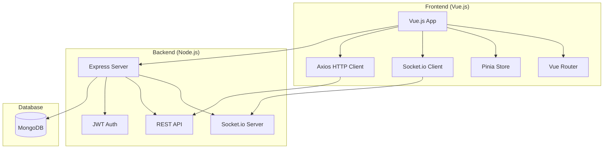
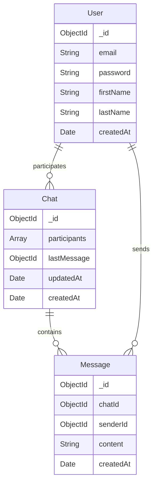

# 💬 ZaloClone - Real-time Messaging Application

## 📋 Project Overview

A simplified real-time messaging application built with Vue.js frontend and Node.js WebSocket backend, focusing on core messaging features.

## 🏗️ Architecture



## 📁 Project Structure

```
zalo-clone/
├── frontend/
│   ├── src/
│   │   ├── components/
│   │   │   ├── Chat/
│   │   │   │   ├── ChatWindow.vue
│   │   │   │   ├── MessageList.vue
│   │   │   │   └── MessageInput.vue
│   │   │   ├── Sidebar/
│   │   │   │   ├── ChatList.vue
│   │   │   │   └── UserList.vue
│   │   │   └── Auth/
│   │   │       ├── Login.vue
│   │   │       └── Register.vue
│   │   ├── views/
│   │   │   ├── Home.vue
│   │   │   └── Chat.vue
│   │   ├── store/
│   │   │   ├── auth.js
│   │   │   ├── chat.js
│   │   │   └── index.js
│   │   ├── services/
│   │   │   ├── api.js
│   │   │   └── socket.js
│   │   ├── router/
│   │   │   └── index.js
│   │   └── App.vue
│   └── package.json
│
├── backend/
│   ├── src/
│   │   ├── controllers/
│   │   │   ├── authController.js
│   │   │   ├── chatController.js
│   │   │   └── messageController.js
│   │   ├── models/
│   │   │   ├── User.js
│   │   │   ├── Chat.js
│   │   │   └── Message.js
│   │   ├── middleware/
│   │   │   └── auth.js
│   │   ├── routes/
│   │   │   ├── auth.js
│   │   │   ├── chat.js
│   │   │   └── message.js
│   │   ├── socket/
│   │   │   └── socketHandler.js
│   │   ├── config/
│   │   │   └── database.js
│   │   └── app.js
│   └── package.json
│
└── README.md
```

## 🔧 Technology Stack

### Frontend
- **Vue.js 3** with Composition API
- **Vue Router** for navigation
- **Pinia** for state management
- **Socket.io Client** for real-time communication
- **Axios** for HTTP requests
- **Tailwind CSS** for styling

### Backend
- **Node.js** with Express.js
- **Socket.io** for WebSocket communication
- **MongoDB** with Mongoose ODM
- **JWT** for authentication
- **bcrypt** for password hashing

## 🚀 Implementation Plan

### Phase 1: Authentication & Setup (Week 1)

#### Backend Foundation
- [x] Express server setup
- [x] MongoDB connection
- [x] User model and authentication
- [x] JWT implementation
- [x] Basic API routes (register/login)

#### Frontend Foundation
- [x] Vue.js project setup
- [x] Router configuration
- [x] Authentication pages (Login/Register)
- [x] Pinia store for auth state
- [x] API service setup

### Phase 2: Real-time Messaging (Week 2)

#### Backend Messaging
- [x] Chat and Message models
- [x] Socket.io server setup
- [x] Real-time message handling
- [x] Message persistence to MongoDB

#### Frontend Chat Interface
- [x] Chat list component
- [x] Message display component
- [x] Message input component
- [x] Socket.io client integration
- [x] Real-time message updates

### Phase 3: Message History & Polish (Week 3)

#### Message History
- [x] Load previous messages
- [x] Pagination for large chat histories
- [x] Message timestamps
- [x] Chat creation and management

#### UI/UX Polish
- [x] Responsive design
- [x] Basic styling with Tailwind
- [x] Error handling
- [x] Loading states

## 📊 Database Schema



## 🔗 API Endpoints

### Authentication
- `POST /api/auth/register` - User registration
- `POST /api/auth/login` - User login
- `GET /api/auth/me` - Get current user

### Chats
- `GET /api/chats` - Get user's chats
- `POST /api/chats` - Create new chat
- `GET /api/chats/:id/messages` - Get messages

### Messages
- `POST /api/messages` - Send message

## 🌐 WebSocket Events

### Core Events
- `join_chat` - Join chat room
- `send_message` - Send new message
- `receive_message` - Receive message
- `connect/disconnect` - Connection management

## 🎯 Core Features

1. **User Registration/Login** with email and password
2. **Find and start chats** with other users
3. **Send and receive messages** in real-time
4. **View chat history** when opening a conversation
5. **Simple chat list** showing recent conversations

## 🔄 Future Enhancements

After completing the core features, consider adding:
- Group chats
- File sharing
- Emoji reactions
- Message editing/deletion
- Online status indicators
- Push notifications
- Message search
- Profile pictures

## 🚀 Getting Started

### Prerequisites
- Node.js (v16 or higher)
- MongoDB
- npm or yarn

### Installation
```bash
# Clone the repository
git clone <repository-url>
cd zalo-clone

# Install backend dependencies
cd backend
npm install

# Install frontend dependencies
cd ../frontend
npm install
```

### Development
```bash
# Start backend server
cd backend
npm run dev

# Start frontend development server
cd frontend
npm run dev
```

## 📝 Notes

This project focuses on core messaging functionality to create a solid foundation. The architecture is designed to be scalable and easily extendable for future feature additions.